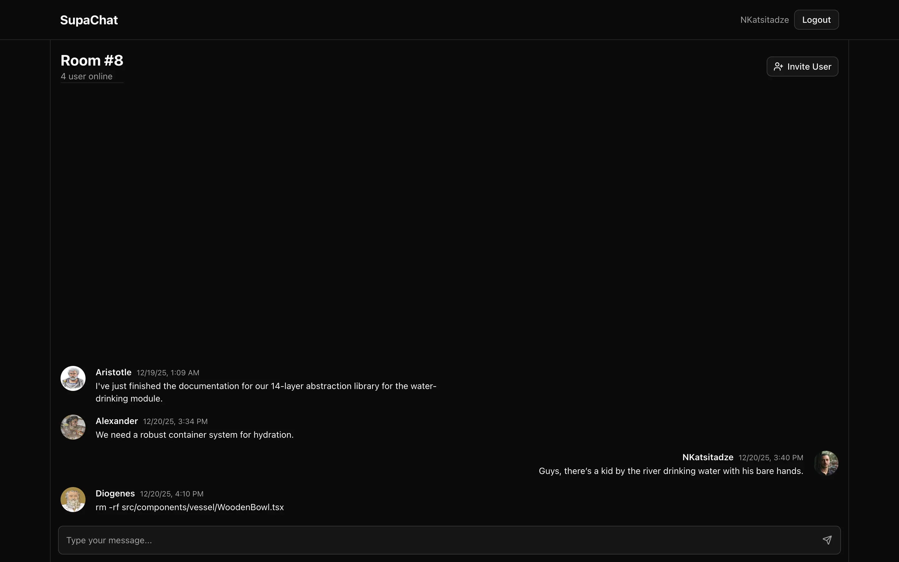
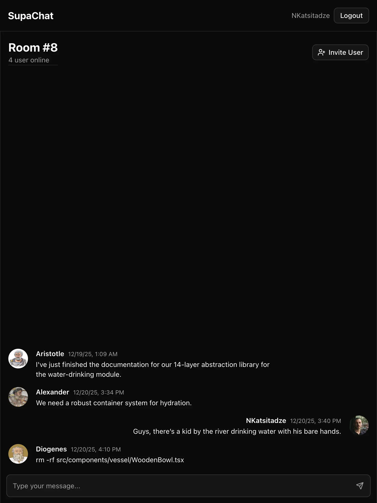
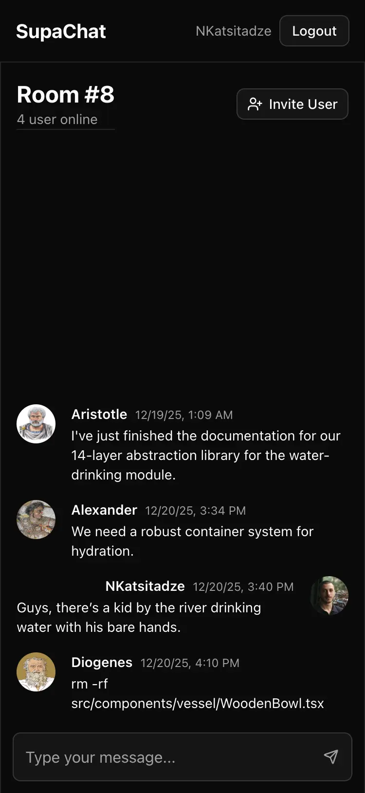

# Realtime Chat App

A realtime chat application built with Next.js and Supabase, focused on realtime data flow, authentication, and clean UX.

## Preview





Live demo: https:realtime-chat-ruddy.vercel.app

---

## Features

- GitHub authentication using Supabase Auth
- Realtime messaging via Supabase Realtime subscriptions
- Private chat rooms with membership-based access
- Online user presence tracking
- Optimistic UI updates for messages
- Responsive layout from mobile to large screens

---

## Tech Stack

- **Next.js** (App Router)
- **TypeScript**
- **Supabase**
  - Auth
  - PostgreSQL
  - Realtime
- **Tailwind CSS**
- **PostgreSQL Row-Level Security (RLS)**

---

## Key Technical Decisions

- Messages are persisted in PostgreSQL and streamed in realtime using Supabase subscriptions
- Room access and message visibility are enforced at the database level using RLS policies
- Realtime loading states are tied to subscription lifecycle instead of manual polling
- The UI is intentionally scoped to avoid feature bloat and keep the codebase readable

---

## Running Locally

1. Clone the repository
2. Create a Supabase project
3. Add the following environment variables:

```bash
NEXT_PUBLIC_SUPABASE_URL=
NEXT_PUBLIC_SUPABASE_ANON_KEY=
+
# npm install
# npm run dev
```
